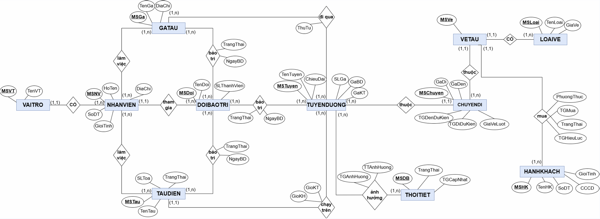

## 👨‍👩‍👧‍👦 CÁC THÀNH VIÊN ĐÓNG GÓP 
----------
- 23520285 - Lương Kiều Diễm
- 23520415 - Trần Thanh Hà
- 23520430 - Lê Thị Ngọc Hân

## 🧭 MÔ TẢ ĐỀ TÀI  
----------
**Hệ thống Quản lý Metro** được xây dựng nhằm hỗ trợ quản lý và vận hành hệ thống tàu điện Metro trong bối cảnh đô thị hóa nhanh, mật độ dân cư cao và tình trạng ùn tắc giao thông nghiêm trọng tại các thành phố lớn ở Việt Nam như TP.HCM và Hà Nội. Hệ thống góp phần giảm tải giao thông đường bộ, hạn chế ô nhiễm môi trường và nâng cao chất lượng di chuyển của người dân.

Ngoài các chức năng quản lý vận hành cơ bản, hệ thống còn tích hợp dữ liệu thời tiết để hỗ trợ dự đoán tình trạng hoạt động của các tuyến Metro trong điều kiện thời tiết xấu (tạm hoãn, hủy chuyến, không ảnh hưởng), giúp hành khách và đơn vị quản lý chủ động hơn trong việc điều phối và di chuyển.

Trong đồ án lần này, nhóm sẽ thiết kế hệ thống quản lý toàn bộ hoạt động vận hành của Metro, bao gồm:
- Ga tàu, tuyến đường và tàu điện
- Lịch trình và chuyến đi
- Vé tàu và hành khách
- Nhân viên và hoạt động bảo trì
- Dự báo thời tiết và ảnh hưởng đến tuyến Metro
Điểm nổi bật của hệ thống là tích hợp dự báo thời tiết, giúp nâng cao khả năng hỗ trợ ra quyết định và trải nghiệm người dùng.

## 👥 CÁC ĐỐI TƯỢNG HƯỚNG ĐẾN 
----------
Hệ thống phục vụ nhiều nhóm người dùng với quyền hạn khác nhau:
- Quản trị viên: Quản lý toàn bộ hệ thống Metro (tàu, ga, tuyến, chuyến đi, nhân viên, hành khách), thực hiện các thao tác xem, thêm, sửa, xóa và cập nhật dữ liệu.
- Quản lý ga: Quản lý nhân viên, bảo trì ga và theo dõi thông tin liên quan đến ga, tàu, tuyến và chuyến đi.
- Nhân viên bán vé: Quản lý vé và thông tin hành khách; tra cứu thông tin tàu, ga, tuyến và chuyến đi.
- Nhân viên bảo trì: Theo dõi thông tin bảo trì liên quan đến ga, tuyến, tàu và chuyến đi được phân công.
- Hành khách: Tra cứu thông tin tàu, ga, tuyến, lịch trình, vé, lịch bảo trì và tình trạng ảnh hưởng bởi thời tiết.

## 🧩 LƯỢC ĐỒ ERD 
----------

## 🎯 KẾT QUẢ ĐẠT ĐƯỢC 
----------
Trong quá trình thực hiện đề tài **Hệ thống quản lý Metro**, nhóm đã vận dụng các kiến thức về xử lý dữ liệu, thiết kế Menu, Form, Report và Help để xây dựng một hệ thống quản lý thông tin có tổ chức.

Hệ thống đáp ứng các yêu cầu quản lý như:
- Quản lý tàu điện, ga tàu và tuyến đường
- Quản lý chuyến đi và vé tàu
- Quản lý hành khách và nhân sự
- Quản lý đội bảo trì
- Tích hợp dự báo thời tiết

Hệ thống sử dụng cơ sở dữ liệu quan hệ MySQL, hỗ trợ đầy đủ các chức năng thêm, xóa, sửa và tra cứu dữ liệu. Giao diện được thiết kế đơn giản, dễ sử dụng.

Thông qua đề tài, nhóm hiểu rõ hơn quy trình phân tích, thiết kế hệ thống quản lý thông tin và nâng cao kỹ năng phân tích, xử lý dữ liệu.

## ⚠️ ƯU VÀ NHƯỢC ĐIỂM CỦA ĐỒ ÁN 
----------
*1. Về ưu điểm:*
- Hệ thống lưu trữ và quản lý đầy đủ, có tổ chức các thông tin liên quan đến
  tàu điện, ga tàu, tuyến đường, hành khách, vé tàu và chuyến đi.
- Cơ sở dữ liệu được thiết kế theo mô hình quan hệ và quản lý bằng MySQL,
  giúp đảm bảo tính nhất quán, an toàn và dễ thao tác với dữ liệu.
- Mã nguồn rõ ràng, dễ bảo trì và thuận lợi cho việc mở rộng hệ thống trong tương lai.
- Tích hợp dữ liệu dự báo thời tiết giúp hành khách chủ động lựa chọn tuyến đường
  phù hợp trong điều kiện thời tiết không thuận lợi.
*2. Về nhược điểm:*
- Phạm vi các tuyến Metro còn hạn chế.
- Chưa triển khai đầy đủ các cơ chế bảo mật cho mật khẩu người dùng và dữ liệu hệ thống.
- Hệ thống hiện quản lý nhiều thực thể, việc mở rộng thêm có thể làm tăng độ phức tạp
  trong liên kết giữa các bảng dữ liệu.
- Chưa hỗ trợ xác định mức độ ảnh hưởng của thời tiết đến từng ga cụ thể.

## 🚀 HƯỚNG PHÁT TRIỂN TRONG TƯƠNG LAI
----------
- Đề xuất tuyến đường và ga xuống phù hợp dựa trên điểm đến của hành khách,
  đồng thời cung cấp chỉ dẫn di chuyển đến ga tàu.
- Kết hợp với các hệ quản trị cơ sở dữ liệu khác như Oracle hoặc MongoDB
  để nâng cao khả năng quản lý và mở rộng dữ liệu.
- Mở rộng thêm các tuyến Metro kết nối với các tỉnh, thành phố lân cận
  như Đồng Nai, Bà Rịa – Vũng Tàu, Bình Phước và các khu vực xa hơn.
- Phát triển website cho hệ thống và tích hợp Chatbot hỗ trợ người dùng.
- Nâng cao mức độ tích hợp dữ báo thời tiết, xác định ảnh hưởng đến từng ga cụ thể.
- Tăng cường bảo mật bằng cách mã hóa dữ liệu và mật khẩu người dùng.
  
## 🛠️ CÁC CÔNG CỤ SỬ DỤNG 
----------
- Hệ quản trị cơ sở dữ liệu MySQL và Excel: được sử dụng để thu thập lưu trữ dữ liệu 
- DrawDB và Draw.io: được sử dụng để phân tích và thiết kế sơ đồ

## 📊 KHẢO SÂT
-----------
1. [Railway Management System _Group10](urlhttps://github.com/fuboki10/Railway-Management-System/tree/master)
2. [McMahon, P., Zhang, T., & Dwight, R. (2020). Requirements for big data adoption for railway asset management. IEEE Access, 8, 15543–15564](url) 
